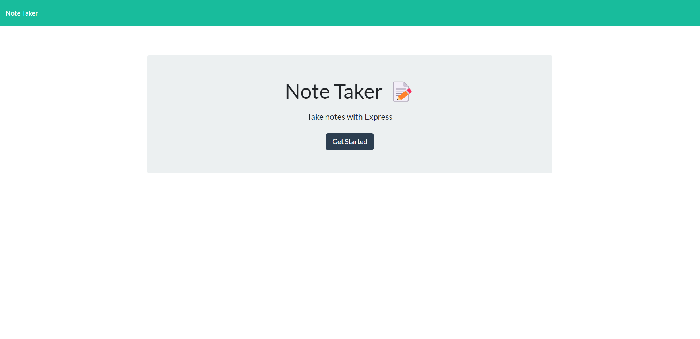

# HW-9-Express-NoteTaker
Take notes with express! A relatively simple 'database' notetaking app.

## Table of Contents
- [Introduction](#introduction)
- [Application Preview](#application-preview)
- [Tech Stack](#tech-stack)
- [Installation](#installation)
- [Project Notes](#project-notes)

## Introduction
A notetaking app that uses a pseudo database file (json) that stores user notes. Based on the express framework, api and html routes were connected through a series of get, post, and delete methods. ViewRoutes contain routing information for all future and current html files whereas index.js within the api directory contains routing information for all future and current api files.

## Application Preview
Deployed Heroku site [here.](https://hw-9-express-notetaker.herokuapp.com/)

## Tech Stack
Technologies used includes:
1. Nodejs
2. Express
3. Heroku

## Project Notes
1. Read/Write/Append methods used are inefficient and read entire json 'database'. For future bigger projects and for scability purposes, use data streams and pipelines.
2. db.json has no auth and the data universally available to everyone. Data resets every 24 hours according to Heroku documentation.
